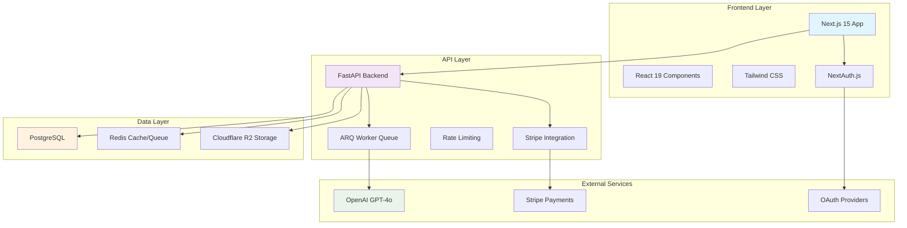
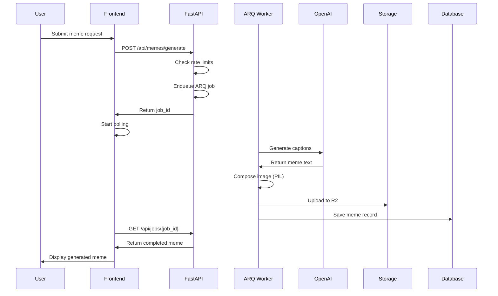

# Design Document: MemeGPT Migration Completion

## Overview

This design document outlines the complete migration of MemeGPT from a v1 Streamlit-based application to a v2 Next.js + FastAPI architecture. The migration involves integrating new features from the `new-change` folder, including user authentication, billing integration, enhanced UI components, and improved backend services. The migration transforms a simple meme generator into a production-ready SaaS platform with user accounts, subscription tiers, and API access.

The migration encompasses both architectural transformation (Streamlit → Next.js/FastAPI) and feature enhancement (adding dashboard, gallery, billing, rate limiting, and API functionality). This represents a complete platform upgrade from a proof-of-concept to a scalable, monetizable service.

## Architecture



## Main Algorithm/Workflow



## Components and Interfaces

### Frontend Components

#### MemeGenerator Component
**Purpose**: Core meme generation interface with input handling and result display

**Interface**:
```typescript
interface MemeGeneratorProps {
  user?: User;
  onMemeGenerated?: (meme: GeneratedMeme) => void;
}

interface MemeGeneratorState {
  prompt: string;
  generating: boolean;
  jobId: string | null;
  error: string | null;
}
```

**Responsibilities**:
- Handle user input for meme prompts
- Submit generation requests to API
- Poll for job completion status
- Display generated memes with sharing options
- Handle rate limiting and error states

#### DashboardClient Component
**Purpose**: User dashboard for account management, meme history, and billing

**Interface**:
```typescript
interface DashboardClientProps {
  userEmail: string;
  apiToken?: string;
}

interface DashboardState {
  user: User | null;
  memes: GeneratedMeme[];
  totalMemes: number;
  loading: boolean;
  keyVisible: boolean;
}
```

**Responsibilities**:
- Display user statistics and usage metrics
- Manage meme history with delete functionality
- Handle API key visibility and copying
- Integrate Stripe checkout for plan upgrades
- Show billing and subscription status

#### GalleryClient Component
**Purpose**: Public gallery for browsing and discovering memes

**Interface**:
```typescript
interface GalleryClientState {
  sort: SortMode;
  search: string;
  memes: GeneratedMeme[];
  page: number;
  total: number;
  loading: boolean;
}

type SortMode = "recent" | "top" | "trending";
```

**Responsibilities**:
- Implement infinite scroll pagination
- Provide sorting and filtering options
- Handle search functionality
- Display memes in responsive grid layout

### Backend Services

#### Rate Limiting Service
**Purpose**: Implement sliding window rate limiting per user/IP

**Interface**:
```python
async def check_rate_limit(
    identifier: str,
    limit: int,
    window: str = "day"
) -> tuple[int, int]:
    """Returns (current_count, remaining)"""
    pass

async def rate_limit_request(
    request: Request, 
    user=None
) -> tuple[int, int]:
    """Determine limits and check for request"""
    pass
```

**Responsibilities**:
- Track usage per user/IP using Redis
- Apply different limits based on user plan
- Raise HTTP 429 when limits exceeded
- Provide rate limit headers in responses

#### Stripe Integration Service
**Purpose**: Handle subscription billing and plan upgrades

**Interface**:
```python
class CheckoutRequest(BaseModel):
    plan: str
    success_url: str
    cancel_url: str

@router.post("/checkout")
async def create_checkout(
    body: CheckoutRequest,
    current_user: User = Depends(get_current_user)
) -> CheckoutResponse:
    pass
```

**Responsibilities**:
- Create Stripe checkout sessions
- Handle webhook events for subscription changes
- Manage customer portal access
- Update user plans in database

## Data Models

### User Model
```python
class User(Base):
    __tablename__ = "users"
    
    id: str = Column(String, primary_key=True)
    email: str = Column(String, unique=True, nullable=False)
    plan: str = Column(String, default="free")
    daily_limit: int = Column(Integer, default=5)
    daily_used: int = Column(Integer, default=0)
    api_key: str = Column(String, nullable=True)
    created_at: datetime = Column(DateTime, default=datetime.utcnow)
    updated_at: datetime = Column(DateTime, default=datetime.utcnow)
```

**Validation Rules**:
- Email must be valid format and unique
- Plan must be one of: "free", "pro", "api"
- Daily limit must be positive integer
- API key only set for "api" plan users

### GeneratedMeme Model
```python
class GeneratedMeme(Base):
    __tablename__ = "memes"
    
    id: str = Column(String, primary_key=True)
    user_id: str = Column(String, ForeignKey("users.id"), nullable=True)
    prompt: str = Column(Text, nullable=False)
    template_name: str = Column(String, nullable=False)
    meme_text: list[str] = Column(JSON, nullable=False)
    image_url: str = Column(String, nullable=False)
    thumbnail_url: str = Column(String, nullable=True)
    share_count: int = Column(Integer, default=0)
    is_public: bool = Column(Boolean, default=True)
    created_at: datetime = Column(DateTime, default=datetime.utcnow)
```

**Validation Rules**:
- Prompt must be non-empty and max 1000 characters
- Template name must exist in meme_data.json
- Meme text array must match template text field count
- Image URL must be valid HTTPS URL
- Share count must be non-negative

## Algorithmic Pseudocode

### Main Migration Algorithm

```pascal
ALGORITHM completeMemeGPTMigration()
INPUT: existing v1 codebase, new-change files
OUTPUT: fully migrated v2 application

BEGIN
  // Phase 1: Backend Migration
  CALL migrateBackendServices()
  CALL integrateNewAPIEndpoints()
  CALL setupDatabaseModels()
  
  // Phase 2: Frontend Migration  
  CALL migrateFrontendComponents()
  CALL integrateNewUIComponents()
  CALL setupAuthenticationFlow()
  
  // Phase 3: Feature Integration
  CALL integrateBillingSystem()
  CALL setupRateLimiting()
  CALL migrateDataStructures()
  
  // Phase 4: Configuration & Deployment
  CALL updateEnvironmentConfig()
  CALL setupDockerConfiguration()
  CALL validateMigration()
  
  RETURN migrationComplete
END
```

**Preconditions**:
- Existing v1 MemeGPT codebase is functional
- New-change folder contains all required migration files
- Database and Redis services are available
- Required API keys (OpenAI, Stripe) are configured

**Postconditions**:
- V2 application is fully functional with all new features
- All v1 data is preserved and migrated
- New authentication and billing systems are operational
- Rate limiting and API access are properly configured

### Backend Service Migration Algorithm

```pascal
ALGORITHM migrateBackendServices()
INPUT: v1 Python files, new FastAPI structure
OUTPUT: integrated FastAPI backend

BEGIN
  // Integrate new main.py with existing functionality
  existingLogic ← extractBusinessLogic(v1Files)
  newMainApp ← loadFile("new-change/main.py")
  
  // Merge meme generation logic
  FOR each oldFunction IN existingLogic DO
    IF isReusable(oldFunction) THEN
      adaptedFunction ← adaptToFastAPI(oldFunction)
      integrateIntoNewApp(adaptedFunction, newMainApp)
    END IF
  END FOR
  
  // Setup new services
  CALL setupRateLimitingService("new-change/rate_limit.py")
  CALL setupStripeIntegration("new-change/stripe.py")
  CALL setupDatabaseModels()
  
  // Configure middleware and routing
  CALL configureCORS()
  CALL setupAPIRouting()
  
  RETURN integratedBackend
END
```

**Preconditions**:
- V1 Python files contain extractable business logic
- New FastAPI structure is properly defined
- Database connection is configured

**Postconditions**:
- FastAPI backend includes all v1 functionality
- New services (rate limiting, billing) are integrated
- API endpoints are properly configured and secured

### Frontend Component Integration Algorithm

```pascal
ALGORITHM integrateFrontendComponents()
INPUT: existing Next.js structure, new React components
OUTPUT: enhanced frontend application

BEGIN
  // Integrate new dashboard functionality
  dashboardComponent ← loadFile("new-change/DashboardClient.tsx")
  CALL integrateComponent(dashboardComponent, "app/dashboard")
  
  // Integrate gallery functionality
  galleryComponent ← loadFile("new-change/GalleryClient.tsx")
  CALL integrateComponent(galleryComponent, "app/gallery")
  
  // Update existing components with new features
  FOR each existingComponent IN frontendComponents DO
    IF hasEnhancements(existingComponent) THEN
      CALL enhanceComponent(existingComponent)
    END IF
  END FOR
  
  // Setup routing and navigation
  CALL updateAppRouting()
  CALL integrateAuthenticationFlow()
  
  // Configure API integration
  CALL updateAPIEndpoints()
  CALL setupErrorHandling()
  
  RETURN enhancedFrontend
END
```

**Preconditions**:
- Next.js application structure exists
- New React components are properly typed
- API endpoints are available and documented

**Postconditions**:
- All new components are integrated and functional
- Routing supports new pages (dashboard, gallery)
- Authentication flow is properly implemented
- API integration handles all new endpoints

## Key Functions with Formal Specifications

### Function 1: migrateUserData()

```python
async def migrateUserData(
    old_session_data: dict,
    new_user_model: User
) -> User:
    """Migrate user session data to new user model"""
    pass
```

**Preconditions:**
- `old_session_data` contains valid session information
- `new_user_model` is properly initialized
- Database connection is established

**Postconditions:**
- User data is successfully migrated to new schema
- No data loss occurs during migration
- New user model contains all relevant historical data

**Loop Invariants:** N/A (no loops in this function)

### Function 2: integrateStripeWebhook()

```python
async def integrateStripeWebhook(
    event: dict,
    signature: str,
    db_session: AsyncSession
) -> bool:
    """Process Stripe webhook events securely"""
    pass
```

**Preconditions:**
- `event` is a valid Stripe webhook payload
- `signature` is provided for verification
- `db_session` is an active database session

**Postconditions:**
- Webhook signature is verified before processing
- User plan updates are applied atomically
- Returns `True` if processing successful, `False` otherwise
- No unauthorized plan changes occur

**Loop Invariants:** N/A (no loops in this function)

### Function 3: migrateTemplateData()

```python
def migrateTemplateData(
    old_templates: list[dict],
    new_format: dict
) -> list[dict]:
    """Migrate meme template data to new format"""
    pass
```

**Preconditions:**
- `old_templates` is a valid list of template dictionaries
- `new_format` defines the target schema structure
- All required template fields are present

**Postconditions:**
- All templates are converted to new format
- No template data is lost during conversion
- New format validates against schema requirements
- Template count remains unchanged

**Loop Invariants:**
- All processed templates conform to new format
- Template ID uniqueness is maintained throughout iteration

## Example Usage

```typescript
// Frontend: Generate meme with new API
const generateMeme = async (prompt: string) => {
  const response = await fetch('/api/memes/generate', {
    method: 'POST',
    headers: { 'Content-Type': 'application/json' },
    body: JSON.stringify({ prompt })
  });
  
  const { job_id } = await response.json();
  
  // Poll for completion
  const result = await pollJobStatus(job_id);
  return result;
};

// Backend: Handle rate-limited generation
@router.post("/generate")
async def generate_meme(
    request: GenerateMemeRequest,
    current_user: User = Depends(get_current_user_optional),
    db: AsyncSession = Depends(get_db)
):
    # Check rate limits
    used, remaining = await rate_limit_request(request, current_user)
    
    # Enqueue generation job
    job = await enqueue_meme_generation(request.prompt, current_user)
    
    return {"job_id": job.id, "remaining": remaining}

// Migration: Integrate new components
const MigrationProcess = () => {
  // 1. Backup existing data
  await backupV1Data();
  
  // 2. Migrate backend services
  await integrateNewBackend();
  
  // 3. Migrate frontend components
  await integrateDashboard();
  await integrateGallery();
  
  // 4. Setup new features
  await setupBilling();
  await setupRateLimit();
  
  return "Migration completed successfully";
};
```

## Correctness Properties

The migration system must satisfy these universal properties:

**Property 1: Data Preservation**
```
∀ data ∈ V1System : ∃ migratedData ∈ V2System : 
  semanticallyEquivalent(data, migratedData) ∧ accessible(migratedData)
```

**Property 2: Feature Completeness**
```
∀ feature ∈ V1Features : ∃ enhancedFeature ∈ V2Features :
  functionallySupersedes(enhancedFeature, feature)
```

**Property 3: Authentication Security**
```
∀ request ∈ AuthenticatedRequests : 
  validToken(request.token) ∧ authorizedUser(request.user) ∧ withinRateLimit(request)
```

**Property 4: Billing Integrity**
```
∀ user ∈ Users : 
  (user.plan = "free" → user.daily_limit = 5) ∧
  (user.plan = "pro" → user.daily_limit = 500) ∧
  (user.plan = "api" → user.daily_limit = 500 ∧ user.api_key ≠ null)
```

**Property 5: Migration Atomicity**
```
∀ migrationStep ∈ MigrationProcess :
  (completed(migrationStep) ∨ rollback(migrationStep)) ∧
  ¬partialState(migrationStep)
```

## Error Handling

### Error Scenario 1: Migration Data Loss
**Condition**: When migrating user data or meme templates fails
**Response**: Halt migration, restore from backup, log detailed error
**Recovery**: Retry migration with corrected data mapping, validate integrity

### Error Scenario 2: Stripe Webhook Failure
**Condition**: When webhook signature verification fails or processing errors occur
**Response**: Return 400 status, log security event, do not update user plans
**Recovery**: Manual verification of legitimate webhooks, replay if necessary

### Error Scenario 3: Rate Limit Service Unavailable
**Condition**: When Redis connection fails during rate limit checks
**Response**: Fail open with conservative limits, log service degradation
**Recovery**: Restore Redis connection, sync rate limit counters from database

### Error Scenario 4: Component Integration Failure
**Condition**: When new React components fail to integrate with existing routing
**Response**: Graceful degradation to basic functionality, error boundary handling
**Recovery**: Fix component dependencies, update routing configuration, test integration

## Testing Strategy

### Unit Testing Approach

Test individual migration functions and new components in isolation:
- Mock external dependencies (Stripe, OpenAI, Redis)
- Validate data transformation correctness
- Test error handling and edge cases
- Ensure backward compatibility with v1 data

**Key Test Cases**:
- User data migration with various v1 session formats
- Template data conversion with missing or invalid fields
- Rate limiting logic with different user plans
- Stripe webhook processing with various event types

### Property-Based Testing Approach

Use property-based testing to verify migration correctness across diverse inputs:

**Property Test Library**: fast-check (for TypeScript) and Hypothesis (for Python)

**Test Properties**:
- Data preservation: migrated data maintains semantic equivalence
- Schema compliance: all migrated data validates against new schemas
- Rate limiting: usage tracking remains consistent across migrations
- Authentication: token validation works for all user types

### Integration Testing Approach

Test complete migration workflow and new feature interactions:
- End-to-end migration from v1 to v2
- Authentication flow with OAuth providers
- Billing integration with Stripe test environment
- API functionality with rate limiting and authentication

**Integration Scenarios**:
- Complete user journey from signup to meme generation
- Plan upgrade flow with webhook processing
- Public gallery functionality with search and filtering
- API access with key authentication and rate limiting

## Performance Considerations

**Database Migration**: Use batch processing for large datasets, implement progress tracking, ensure minimal downtime during schema updates.

**Image Storage**: Migrate existing images to Cloudflare R2 with parallel uploads, implement CDN caching, optimize image formats and sizes.

**Rate Limiting**: Use Redis for high-performance rate limit tracking, implement sliding window algorithms, cache user plan information.

**Frontend Performance**: Implement code splitting for new components, optimize bundle sizes, use React.memo for expensive components, implement virtual scrolling for large galleries.

## Security Considerations

**Authentication**: Implement secure OAuth flows, validate JWT tokens, use secure session management, implement CSRF protection.

**API Security**: Validate all inputs, implement rate limiting, use API key authentication, sanitize user-generated content.

**Billing Security**: Verify Stripe webhook signatures, validate subscription states, implement idempotent payment processing, secure API key storage.

**Data Protection**: Encrypt sensitive data at rest, implement secure data migration, validate user permissions, audit access logs.

## Dependencies

**Frontend Dependencies**:
- Next.js 15 with React 19
- NextAuth.js for authentication
- Tailwind CSS for styling
- SWR for data fetching
- Framer Motion for animations

**Backend Dependencies**:
- FastAPI for API framework
- SQLAlchemy for database ORM
- Alembic for database migrations
- ARQ for async job processing
- Redis for caching and queues

**External Services**:
- OpenAI GPT-4o for meme generation
- Stripe for payment processing
- Cloudflare R2 for image storage
- PostgreSQL for data persistence
- OAuth providers (Google, GitHub)

**Development Tools**:
- Docker for containerization
- TypeScript for type safety
- ESLint and Prettier for code quality
- pytest for Python testing
- Jest for JavaScript testing