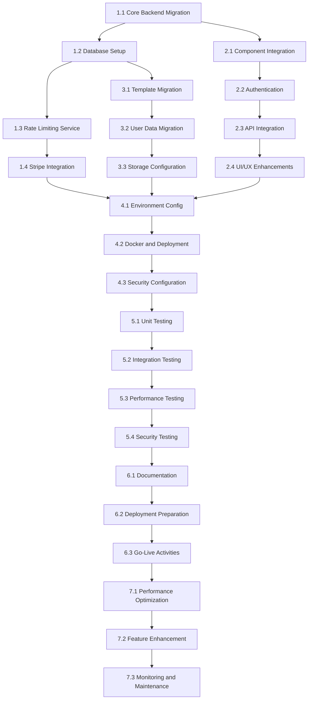

# Tasks: MemeGPT Migration Completion

## 1. Backend Migration and Integration

### 1.1 Core Backend Migration
- [x] 1.1.1 Integrate new FastAPI main.py with existing v1 logic
- [x] 1.1.2 Migrate meme generation functions from v1 to FastAPI structure
- [x] 1.1.3 Setup ARQ worker queue for async meme generation
- [x] 1.1.4 Configure CORS middleware for frontend communication
- [x] 1.1.5 Implement health check endpoint

### 1.2 Database Setup and Migration
- [x] 1.2.1 Create database models from new-change files
- [x] 1.2.2 Setup Alembic migrations for schema creation
- [x] 1.2.3 Migrate existing meme_data.json to new database format
- [x] 1.2.4 Create database connection and session management
- [x] 1.2.5 Implement database backup before migration

### 1.3 Rate Limiting Service Integration
- [ ] 1.3.1 Integrate rate_limit.py from new-change folder
- [ ] 1.3.2 Setup Redis connection for rate limit storage
- [ ] 1.3.3 Implement sliding window rate limiting logic
- [ ] 1.3.4 Add rate limit middleware to FastAPI routes
- [ ] 1.3.5 Configure different limits for user tiers

<!-- ### 1.4 Stripe Billing Integration
- [ ] 1.4.1 Integrate stripe.py from new-change folder
- [ ] 1.4.2 Setup Stripe webhook endpoint and signature verification
- [ ] 1.4.3 Implement checkout session creation
- [ ] 1.4.4 Handle subscription lifecycle events
- [ ] 1.4.5 Create billing portal integration -->

## 2. Frontend Migration and Enhancement

### 2.1 Component Integration
- [ ] 2.1.1 Integrate DashboardClient.tsx into Next.js app structure
- [ ] 2.1.2 Integrate GalleryClient.tsx into Next.js app structure
- [ ] 2.1.3 Create routing for new dashboard and gallery pages
- [ ] 2.1.4 Update existing components to work with new API structure
- [ ] 2.1.5 Implement error boundaries for new components

### 2.2 Authentication Implementation
- [ ] 2.2.1 Setup NextAuth.js configuration
- [ ] 2.2.2 Configure OAuth providers (Google, GitHub)
- [ ] 2.2.3 Implement protected route middleware
- [ ] 2.2.4 Create login/logout UI components
- [ ] 2.2.5 Handle anonymous user sessions

### 2.3 API Integration
- [ ] 2.3.1 Update API client to work with new FastAPI endpoints
- [ ] 2.3.2 Implement job polling for async meme generation
- [ ] 2.3.3 Add error handling for rate limit responses
- [ ] 2.3.4 Integrate Stripe checkout flow in frontend
- [ ] 2.3.5 Add API key management UI

### 2.4 UI/UX Enhancements
- [ ] 2.4.1 Ensure responsive design for all new components
- [ ] 2.4.2 Implement loading states and progress indicators
- [ ] 2.4.3 Add toast notifications for user feedback
- [ ] 2.4.4 Optimize images and implement lazy loading
- [ ] 2.4.5 Add accessibility features (ARIA labels, keyboard navigation)

## 3. Data Migration and Storage

### 3.1 Template and Asset Migration
- [ ] 3.1.1 Migrate existing meme templates to new format
- [ ] 3.1.2 Upload existing images to Cloudflare R2 storage
- [ ] 3.1.3 Update image URLs to point to R2 CDN
- [ ] 3.1.4 Validate all template metadata after migration
- [ ] 3.1.5 Create backup of original template files

### 3.2 User Data Migration
- [ ] 3.2.1 Create user accounts for existing session data
- [ ] 3.2.2 Migrate meme generation history to new schema
- [ ] 3.2.3 Preserve user preferences and settings
- [ ] 3.2.4 Generate unique user IDs for anonymous sessions
- [ ] 3.2.5 Validate data integrity after migration

### 3.3 Storage Configuration
- [ ] 3.3.1 Configure Cloudflare R2 bucket and permissions
- [ ] 3.3.2 Setup CDN caching policies for images
- [ ] 3.3.3 Implement image optimization pipeline
- [ ] 3.3.4 Create backup strategy for R2 storage
- [ ] 3.3.5 Monitor storage usage and costs

## 4. Configuration and Environment Setup

### 4.1 Environment Configuration
- [ ] 4.1.1 Create production environment variables
- [ ] 4.1.2 Setup development environment configuration
- [ ] 4.1.3 Configure API keys for all external services
- [ ] 4.1.4 Setup database connection strings
- [ ] 4.1.5 Configure Redis connection parameters

### 4.2 Docker and Deployment
- [ ] 4.2.1 Update Docker configurations for new architecture
- [ ] 4.2.2 Create docker-compose.yml for local development
- [ ] 4.2.3 Setup production deployment scripts
- [ ] 4.2.4 Configure health checks for all services
- [ ] 4.2.5 Implement logging and monitoring

### 4.3 Security Configuration
- [ ] 4.3.1 Setup HTTPS certificates and redirects
- [ ] 4.3.2 Configure CORS policies for production
- [ ] 4.3.3 Implement input validation and sanitization
- [ ] 4.3.4 Setup rate limiting and DDoS protection
- [ ] 4.3.5 Configure secure headers and CSP

## 5. Testing and Quality Assurance

### 5.1 Unit Testing
- [ ] 5.1.1 Write unit tests for backend API endpoints
- [ ] 5.1.2 Write unit tests for frontend components
- [ ] 5.1.3 Test rate limiting logic with various scenarios
- [ ] 5.1.4 Test Stripe integration with mock webhooks
- [ ] 5.1.5 Test data migration functions

### 5.2 Integration Testing
- [ ] 5.2.1 Test complete user registration and login flow
- [ ] 5.2.2 Test meme generation end-to-end workflow
- [ ] 5.2.3 Test billing upgrade and downgrade flows
- [ ] 5.2.4 Test API authentication and rate limiting
- [ ] 5.2.5 Test public gallery functionality

### 5.3 Performance Testing
- [ ] 5.3.1 Load test API endpoints under concurrent users
- [ ] 5.3.2 Test database performance with large datasets
- [ ] 5.3.3 Test image upload and storage performance
- [ ] 5.3.4 Test frontend performance on mobile devices
- [ ] 5.3.5 Monitor memory usage and optimize bottlenecks

### 5.4 Security Testing
- [ ] 5.4.1 Test authentication and authorization flows
- [ ] 5.4.2 Test input validation and XSS prevention
- [ ] 5.4.3 Test SQL injection prevention
- [ ] 5.4.4 Test Stripe webhook signature verification
- [ ] 5.4.5 Perform security audit of all endpoints

## 6. Documentation and Deployment

### 6.1 Documentation
- [ ] 6.1.1 Update README with new setup instructions
- [ ] 6.1.2 Create API documentation for developers
- [ ] 6.1.3 Document migration process and rollback procedures
- [ ] 6.1.4 Create user guide for new features
- [ ] 6.1.5 Document deployment and maintenance procedures

### 6.2 Deployment Preparation
- [ ] 6.2.1 Create production deployment checklist
- [ ] 6.2.2 Setup monitoring and alerting systems
- [ ] 6.2.3 Create database backup and recovery procedures
- [ ] 6.2.4 Plan maintenance window for migration
- [ ] 6.2.5 Prepare rollback plan in case of issues

### 6.3 Go-Live Activities
- [ ] 6.3.1 Execute production deployment
- [ ] 6.3.2 Run post-deployment verification tests
- [ ] 6.3.3 Monitor system performance and errors
- [ ] 6.3.4 Communicate launch to users
- [ ] 6.3.5 Collect user feedback and address issues

## 7. Post-Migration Optimization

### 7.1 Performance Optimization
- [ ] 7.1.1 Optimize database queries based on usage patterns
- [ ] 7.1.2 Implement caching for frequently accessed data
- [ ] 7.1.3 Optimize image delivery and CDN configuration
- [ ] 7.1.4 Fine-tune rate limiting parameters
- [ ] 7.1.5 Optimize frontend bundle size and loading

### 7.2 Feature Enhancement
- [ ] 7.2.1 Add sitemap.ts for SEO optimization
- [ ] 7.2.2 Implement social media sharing optimization
- [ ] 7.2.3 Add analytics tracking for user behavior
- [ ] 7.2.4 Implement A/B testing framework
- [ ] 7.2.5 Add user feedback collection system

### 7.3 Monitoring and Maintenance
- [ ] 7.3.1 Setup comprehensive logging and monitoring
- [ ] 7.3.2 Create automated backup procedures
- [ ] 7.3.3 Implement automated testing pipeline
- [ ] 7.3.4 Setup error tracking and alerting
- [ ] 7.3.5 Create maintenance and update procedures

## Task Dependencies

## Estimated Timeline

- **Phase 1 (Backend Migration)**: 2-3 weeks
- **Phase 2 (Frontend Integration)**: 2-3 weeks  
- **Phase 3 (Data Migration)**: 1-2 weeks
- **Phase 4 (Configuration)**: 1 week
- **Phase 5 (Testing)**: 2 weeks
- **Phase 6 (Deployment)**: 1 week
- **Phase 7 (Optimization)**: 1-2 weeks

**Total Estimated Duration**: 10-14 weeks

## Risk Mitigation

- **Data Loss Risk**: Comprehensive backups before each migration step
- **Downtime Risk**: Staged deployment with rollback procedures
- **Performance Risk**: Load testing before production deployment
- **Security Risk**: Security audit and penetration testing
- **Integration Risk**: Extensive integration testing with external services