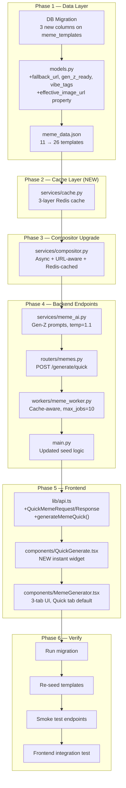

# MemeGPT Gen-Z Enhancement — Implementation Plan

> **Scope**: 13 files in `enhancements/` → 10 target locations across backend + frontend  
> **Risk level**: Medium — touches DB schema, core compositor, router, worker, and frontend generator  
> **Estimated phases**: 6 sequential phases with verification gates

---

## Architecture Overview



---

## Phase 1 — Data Layer (DB + Models + Template Data)

### Task 1.1 · Alembic Migration — `20260507_genz_templates.py`
- [ ] **Copy** `enhancements/20260507_genz_templates.py` → `backend/db/migrations/versions/`
- [ ] **Verify** `down_revision` points to `"20260426_imgflip"` (matches current head ✅)
- [ ] Adds 3 columns: `fallback_url` (String), `gen_z_ready` (Boolean), `vibe_tags` (JSON)
- [ ] Creates index `ix_meme_templates_gen_z_ready`
- [ ] Back-fills IDs 0–10 as `gen_z_ready = true`

> [!IMPORTANT]
> The migration references `down_revision = "20260426_imgflip"` but the actual file uses revision ID `"20260426_imgflip"`. Current head confirms this matches. Run `alembic upgrade head` after copying.

### Task 1.2 · Update `backend/models/models.py`
- [ ] **Replace** with `enhancements/models.py`
- [ ] **Key changes** vs current:
  - `+` `fallback_url: Optional[str]` column (line 148)
  - `+` `gen_z_ready: bool` column with index (line 157)
  - `+` `vibe_tags: Optional[List[str]]` column (line 158)
  - `+` `effective_image_url` property (lines 178–183)
  - Minor: removed verbose docstrings, used tuples for `is_premium` check
  - Minor: removed `self.updated_at = func.now()` from MemeJob methods (handled by `onupdate`)

> [!WARNING]
> The enhancement file **removes** the `updated_at = func.now()` manual assignments in `mark_as_*` methods. SQLAlchemy's `onupdate` handles this automatically. Verify this doesn't break the ARQ worker flow.

### Task 1.3 · Update `public/meme_data.json`
- [ ] **Replace** with `enhancements/meme_data.json`
- [ ] Goes from 11 templates (IDs 0–10) → 26 templates (IDs 0–25)
- [ ] 15 new Gen-Z templates each include:
  - `fallback_url` pointing to Imgflip CDN
  - Updated `usage_instructions` and `example_output` with Gen-Z flavor
  - `alternative_names` for better AI matching

### ✅ Phase 1 Verification Gate
```bash
# Verify migration applies cleanly
cd backend && alembic upgrade head
# Verify JSON has 26 entries
python -c "import json; d=json.load(open('../public/meme_data.json')); print(len(d))"
# Expected: 26
```

---

## Phase 2 — Cache Layer (NEW Service)

### Task 2.1 · Create `backend/services/cache.py`
- [ ] **Copy** `enhancements/cache.py` → `backend/services/cache.py` (new file)
- [ ] Three-layer Redis cache:

| Layer | Key Pattern | TTL | Purpose |
|-------|-------------|-----|---------|
| Caption cache | `cap:{sha256(prompt)[:16]}` | 1 hour | Skip AI call for identical prompts |
| Meme URL cache | `meme:{sha256(template_id\|texts)[:16]}` | 24 hours | Skip composition + upload |
| Template image cache | `tpl:{sha256(url)[:16]}` | 6 hours | Skip remote image download |

- [ ] All cache operations are wrapped in try/except — Redis outage never breaks generation
- [ ] Uses `redis.asyncio` (already installed: `redis==5.0.1` includes async support)
- [ ] Includes `get_cache_stats()` for health endpoint integration

> [!NOTE]
> No new pip dependencies needed. `redis==5.0.1` already ships `redis.asyncio`.

### ✅ Phase 2 Verification Gate
```python
# Verify import works
from services.cache import get_cached_captions, set_cached_captions
```

---

## Phase 3 — Compositor Upgrade

### Task 3.1 · Replace `backend/services/compositor.py`
- [ ] **Replace** with `enhancements/compositor.py`
- [ ] **Key changes** vs current:
  - `+` Async interface: `overlay_text_on_image_async()` (new primary API)
  - `+` Remote image fetching with Redis cache: `_fetch_remote_image()`, `_load_template_image()`
  - `+` Sync shim preserved: `overlay_text_on_image()` wraps async for ARQ compat
  - `+` Fallback compositor `_overlay_local_only()` for when async fails
  - `~` `LINE_HEIGHT_MULTIPLIER` → `LINE_HEIGHT_MUL = 1.35` (was 1.4)
  - `~` Text drawing extracted to `_draw_text_box()` helper
  - `~` Uses `httpx` for remote downloads (already a dependency)
  - `+` `image_url` key now read from template dict for remote URL support

> [!WARNING]
> The `overlay_text_on_image()` sync function signature is unchanged — ARQ worker backward compat preserved. But internally it now delegates to async. The fallback `_overlay_local_only()` catches any async failure and uses local-only PIL.

### ✅ Phase 3 Verification Gate
```python
# Verify backward-compat sync function still works
from services.compositor import overlay_text_on_image
```

---

## Phase 4 — Backend Endpoints & Worker

### Task 4.1 · Update `backend/services/meme_ai.py`
- [ ] **Replace** with `enhancements/meme_ai.py`
- [ ] **Key changes**:
  - `+` Gen-Z cultural context injected into system prompts (`_GEN_Z_CONTEXT`)
  - `+` Structured output schema with `reasoning` field
  - `~` OpenAI temperature: 1.0 → 1.1
  - `~` Rules updated: "3 DIFFERENT templates", "first = mainstream, second = niche, third = wildcard"
  - `+` `get_caption_generator()` factory function (replaces hardcoded provider selection)
  - `+` `AIProvider` enum added

### Task 4.2 · Update `backend/routers/memes.py`
- [ ] **Replace** with `enhancements/memes.py`
- [ ] **Key additions**:
  - `+` `POST /generate/quick` — synchronous fast-path endpoint (no queue)
  - `+` `QuickMemeRequest` / `QuickMemeResponse` schemas
  - `+` `_compose_and_upload()` shared helper (used by quick + future worker)
  - `+` Cache integration: caption cache check → meme URL cache check → generate
  - `~` Seed templates now supports `fallback_url` and `gen_z_ready` fields
  - Import additions: `time`, `services.cache`, `services.compositor.overlay_text_on_image_async`

> [!IMPORTANT]
> The existing `/generate` (async queue) endpoint is **unchanged** — no breaking changes to existing API consumers.

### Task 4.3 · Update `backend/workers/meme_worker.py`
- [ ] **Replace** with `enhancements/meme_worker.py`
- [ ] **Key changes**:
  - `+` Caption cache: check before AI call, store after
  - `+` Meme URL cache: check before composition, store after
  - `+` Uses `overlay_text_on_image_async` instead of sync version
  - `+` Template dict now includes `image_url` key for remote template support
  - `~` `max_jobs = 10` (was 1)
  - `~` `job_timeout = 120` (was default)

### Task 4.4 · Update `backend/main.py`
- [ ] **Replace** with `enhancements/main.py`
- [ ] **Key changes**:
  - `~` `seed_templates_if_needed()` rewritten: now seeds incrementally (only missing templates), not "if empty"
  - `+` New templates seeded with `fallback_url`, `gen_z_ready=True`
  - `~` API version: 2.0.0 → 2.1.0
  - `~` Static file mounting simplified to a loop
  - `~` Added output dir mounting (`/output`)

> [!WARNING]
> The current `main.py` seeds only when DB is **empty**. The enhancement seeds when DB has **fewer templates than JSON** — this is better but changes behavior. Templates missing from DB will be added on next startup.

### ✅ Phase 4 Verification Gate
```bash
# Restart backend
uvicorn main:app --reload --log-level debug

# Test quick endpoint (manual mode)
curl -X POST http://localhost:8000/api/memes/generate/quick \
  -H "Content-Type: application/json" \
  -d '{"template_id": 12, "captions": ["sends 10 texts", "surprised when no reply"]}'

# Test quick endpoint (AI mode)
curl -X POST http://localhost:8000/api/memes/generate/quick \
  -H "Content-Type: application/json" \
  -d '{"prompt": "when the group chat goes quiet after you share your location"}'
```

---

## Phase 5 — Frontend Updates

### Task 5.1 · Update `frontend/src/lib/api.ts`
- [ ] **Replace** with `enhancements/api.ts`
- [ ] **Key additions**:
  - `+` `QuickMemeRequest` / `QuickMemeResponse` interfaces exported
  - `+` `generateMemeQuick()` method on `APIClient`
  - `+` `generateMemeQuick` convenience export
  - `~` Removed SSE `getJobStatusStream()` method (not used by quick path)
  - Minor code style cleanup

### Task 5.2 · Create `frontend/src/components/QuickGenerate.tsx`
- [ ] **Copy** `enhancements/QuickGenerate.tsx` → `frontend/src/components/`
- [ ] Self-contained widget wired to `/generate/quick`
- [ ] Features:
  - 10 rotating Gen-Z placeholder prompts
  - `⌘ + Enter` keyboard shortcut
  - GPT-4o / Gemini provider toggle
  - Cache badge + generation time in ms
  - Confetti on first generate, toast on cache hit
  - Download + copy-link actions
- [ ] Dependencies: `canvas-confetti` ✅ (already installed), `framer-motion` ✅, `react-hot-toast` ✅, `lucide-react` ✅

### Task 5.3 · Update `frontend/src/components/MemeGenerator.tsx`
- [ ] **Replace** with `enhancements/MemeGenerator.tsx`
- [ ] **Key changes**:
  - `+` Three tabs: `[⚡ Quick] [✨ AI Mode] [✏️ Editor]` (was 2 tabs)
  - `+` Default tab is now **Quick** (fastest path for casual users)
  - `+` `QuickGenerate` component imported and rendered in Quick tab
  - `+` `handleQuickGenerated` callback converts `QuickMemeResponse` → `GeneratedMeme` for shared results list
  - `+` Trending topic click → fills Quick prompt and switches to Quick tab
  - `~` `Mode` type: `'auto' | 'manual'` → `'quick' | 'auto' | 'manual'`

### ✅ Phase 5 Verification Gate
```bash
# Verify frontend compiles
cd frontend && npm run build

# Visual check: open http://localhost:5173
# Verify: Quick tab is default, generates meme on submit
```

---

## Phase 6 — Integration & Smoke Test

### Task 6.1 · Run Full Migration
- [ ] `cd backend && alembic upgrade head`

### Task 6.2 · Re-seed Templates
- [ ] Restart backend (auto-seeds on startup)
- [ ] Or manual: `curl -X POST http://localhost:8000/api/memes/seed-templates`

### Task 6.3 · Verify Template Count
- [ ] `curl http://localhost:8000/api/memes/templates | python -m json.tool | grep '"name"' | wc -l`
- [ ] Expected: **26**

### Task 6.4 · End-to-End Quick Generation Test
- [ ] Manual mode (cache miss → ~1–2s)
- [ ] AI mode (cache miss → ~3–5s)
- [ ] Repeat same request (cache hit → <10ms)

### Task 6.5 · Verify Existing Flows Unbroken
- [ ] `POST /api/memes/generate` (async queue) — still works
- [ ] Gallery page loads correctly
- [ ] ARQ worker processes jobs

---

## File Map — Source → Target

| # | Enhancement File | Target Location | Action |
|---|-----------------|-----------------|--------|
| 1 | `20260507_genz_templates.py` | `backend/db/migrations/versions/` | **Copy** (new) |
| 2 | `models.py` | `backend/models/models.py` | **Replace** |
| 3 | `meme_data.json` | `public/meme_data.json` | **Replace** |
| 4 | `cache.py` | `backend/services/cache.py` | **Copy** (new) |
| 5 | `compositor.py` | `backend/services/compositor.py` | **Replace** |
| 6 | `meme_ai.py` | `backend/services/meme_ai.py` | **Replace** |
| 7 | `memes.py` | `backend/routers/memes.py` | **Replace** |
| 8 | `meme_worker.py` | `backend/workers/meme_worker.py` | **Replace** |
| 9 | `main.py` | `backend/main.py` | **Replace** |
| 10 | `api.ts` | `frontend/src/lib/api.ts` | **Replace** |
| 11 | `QuickGenerate.tsx` | `frontend/src/components/QuickGenerate.tsx` | **Copy** (new) |
| 12 | `MemeGenerator.tsx` | `frontend/src/components/MemeGenerator.tsx` | **Replace** |

---

## Risk Assessment

| Risk | Severity | Mitigation |
|------|----------|------------|
| Migration fails on prod DB | 🔴 High | Test on dev DB first; `down_revision` verified ✅ |
| Remote template images 404 | 🟡 Medium | Fallback chain: local → CDN → proxy → error |
| Redis outage breaks generation | 🟢 Low | All cache ops are try/except with silent fallback |
| `overlay_text_on_image` sync compat breaks | 🟡 Medium | Sync shim + `_overlay_local_only` fallback |
| `getJobStatusStream` removed from api.ts | 🟡 Medium | Was added in previous SSE conversation — check if any component uses it |
| Frontend `MemeGenerator` state reset | 🟢 Low | Clean replacement, same component contract |

> [!CAUTION]
> The enhancement `api.ts` **removes** the `getJobStatusStream()` SSE method that was added in a [previous conversation](file:///conversation/651d3765). If any other component (e.g. `MemeGenerator.tsx` or a polling hook) uses SSE, this will break. **Verify before replacing.**
